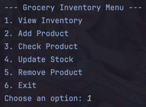

# Warren Denzel F. Cheng

## Part 1 of 2 Grocery Store Inventory System

View Inventory (no items):  

Add Product:  

Check Product:  

Update Stock:  

Remove Product:  

View Inventory (with items):  

Exit:  

***Unit Testing:***  
